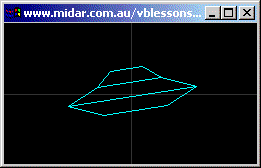



## A 2D Rotation Lesson \- Fly a UFO

### Description

I can't believe how much trouble I went to, to show you how to rotate objects (like a space-ship) around the Z-Axis. This should be a great learning project for people wanting to create their own vector-graphics games... like Asteroids.
 
### More Info
 

             |
---                |---
**Submitted On**   |2003-03-12 10:05:02
**By**             |[Peter Wilson](https://github.com/Planet-Source-Code/PSCIndex/blob/master/ByAuthor/peter-wilson.md)
**Level**          |Beginner
**User Rating**    |5.0 (45 globes from 9 users)
**Compatibility**  |VB 6\.0
**Category**       |[Games](https://github.com/Planet-Source-Code/PSCIndex/blob/master/ByCategory/games__1-38.md)
**World**          |[Visual Basic](https://github.com/Planet-Source-Code/PSCIndex/blob/master/ByWorld/visual-basic.md)
**Archive File**   |[A\_2D\_Rotat1558313122003\.zip](https://github.com/Planet-Source-Code/peter-wilson-a-2d-rotation-lesson-fly-a-ufo__1-43956/archive/master.zip)

